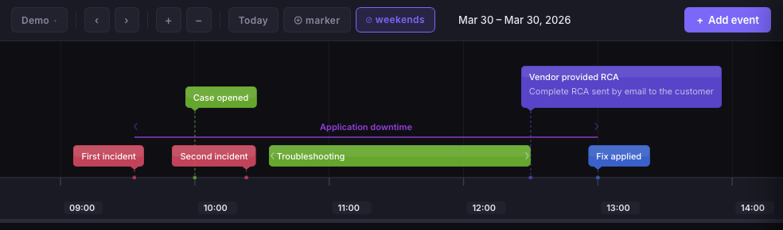

# Timeline

A local, browser-based app for **timelines** and **org charts** — inspired by [time.graphics](https://time.graphics). Create richly styled timelines and hierarchical org charts, all stored in your browser with no backend required.



You can test it on [https://timeline.tynsoe.org](https://timeline.tynsoe.org).

## Features

### Timeline

- **Multiple timelines** — create, rename, and delete independent timelines from the toolbar
- **Import / export** — export a timeline as a `.timeline.json` file (events + viewport); import it back to restore or share
- **SVG export** — export the current view as an SVG file
- **Point & ranged events** — events with only a start date appear as labelled markers; events with a start and end date span a time range
- **Range brackets** — small chevron marks at the start and end of ranged events to clarify the span
- **Three display styles per event**
  - *Solid* — filled colour rectangle with white text
  - *Outline* — border-only frame with coloured text
  - *Label* — text only with an underline bar for ranged events
- **Alignment** — each event can be anchored left, center, or right relative to its date; callout pointers always align with the precise timestamp
- **Notes** — optional multi-line description that can be shown directly on the timeline, respecting the event's text alignment
- **Lane stacking** — overlapping events are automatically assigned to separate vertical lanes; same-colour events are grouped on the same lane when possible
- **Today marker** — a red dashed vertical line marks the current date; togglable from the toolbar
- **Weekend highlights** — subtle background shading for weekends at day/week/month scales; togglable from the toolbar
- **Save / Restore view** — bookmark and recall a viewport position per timeline
- **Smooth navigation** — pan by dragging, zoom with the scroll wheel, or use the toolbar buttons
- **Resizable timeline area** — drag the divider below the timeline to adjust its height; height is stored per-timeline

### Org Chart

- **Multiple org charts** — create, rename, and delete independent org charts
- **Import / export** — export as `.orgchart.json`; import to restore or share
- **SVG / PNG export** — export the current chart as SVG or PNG
- **Person cards** — each person has a first name, last name, role, company, organisation, and colour
- **Photo support** — upload and display a photo on each person card
- **Reporting hierarchy** — solid lines for direct reports, dashed lines for dotted reporting relationships
- **Collapse / expand** — hide or reveal a person's subordinates
- **Visual groups** — frame selected people together with an editable label
- **Focus mode** — highlight a single person and their reporting lineage
- **Card controls toggle** — show or hide edit/delete/collapse buttons on cards
- **Smooth navigation** — pan by dragging, zoom with the scroll wheel, or fit the chart to screen

### General

- **Sidebar navigation** — switch between Timeline and Org Chart modes
- **Persistent storage** — all data (events, people, groups, viewport positions, bookmarks) is saved to `localStorage`; nothing leaves your browser
- **Keyboard shortcuts** — `Escape` to close the editor, `Cmd/Ctrl + Enter` to save
- **Mobile-friendly** — responsive toolbar with overflow menu

## Getting Started

**Prerequisites:** Node.js 18+

```bash
npm install
npm run dev
```

Then open [http://localhost:5173](http://localhost:5173).

### Docker

```bash
docker build -t timeline .
docker run -p 8080:80 timeline
```

Then open [http://localhost:8080](http://localhost:8080).

## Usage

### Timeline

| Action | How |
|---|---|
| Add an event | Click **Add event** in the toolbar |
| Edit / delete an event | Click any event on the timeline |
| Pan | Click and drag the timeline |
| Zoom | Scroll wheel over the timeline |
| Switch / manage timelines | Click the timeline name in the top-left |
| Export timeline | Timeline menu → **Export** |
| Import timeline | Timeline menu → **Import** |
| Export as SVG | Click **SVG** in the toolbar |
| Save / restore view | Click **Save View** / **Restore View** in the toolbar |
| Toggle today marker | Click the today-marker toggle in the toolbar |
| Toggle weekend highlights | Click the weekends toggle in the toolbar |

### Org Chart

| Action | How |
|---|---|
| Add a person | Click **Add person** in the toolbar |
| Edit / delete a person | Click any person card |
| Pan | Click and drag the canvas |
| Zoom | Scroll wheel over the canvas |
| Fit to screen | Click **Fit** in the toolbar |
| Switch / manage org charts | Click the chart name in the top-left |
| Collapse / expand subordinates | Click the collapse control on a person card |
| Focus on a person | Select a person to highlight their lineage |
| Export as SVG / PNG | Org chart menu → **Export SVG** / **Export PNG** |
| Import org chart | Org chart menu → **Import** |

## Tech Stack

- [React 18](https://react.dev/) + [Vite 5](https://vitejs.dev/)
- SVG rendering — no canvas, no third-party charting library
- [date-fns](https://date-fns.org/) for date formatting and tick generation
- `localStorage` for persistence

## Project Structure

```
src/
  App.jsx                     # Root layout, mode switching, state wiring
  components/
    Sidebar/                  # Mode switcher (Timeline / Org Chart)
    Controls/                 # Toolbar for both modes
    EventEditor/              # Slide-in panel for creating/editing events
    EventModal/               # Event detail modal
    Timeline/
      Timeline.jsx            # SVG container, drag/zoom handlers
      TimeAxis.jsx            # Tick generation and axis rendering
      EventLayer.jsx          # Lays out and renders all events
      EventItem.jsx           # Per-event rendering (solid / outline / label)
      TodayLine.jsx           # Red "today" marker
    OrgChart/
      OrgChart.jsx            # SVG canvas, drag/zoom, card rendering
      PersonCard.jsx          # Individual person card with photo & colour
      OrgConnectors.jsx       # Parent-child connectors (solid & dashed)
      GroupOverlays.jsx       # Named group frames around people
    PersonEditor/             # Slide-in panel for creating/editing people
  hooks/
    useTimelines.js           # CRUD + localStorage for timelines
    useEvents.js              # CRUD + localStorage for events
    useViewport.js            # Pan & zoom state (per-timeline)
    useOrgCharts.js           # CRUD + localStorage for org charts
    usePeople.js              # CRUD + localStorage for people
    useGroups.js              # CRUD + localStorage for groups
    useOrgViewport.js         # Pan & zoom state (per-org chart)
  utils/
    eventLayout.js            # Lane assignment algorithm
    eventGeometry.js          # Event dimension calculations
    timeScale.js              # Tick scale levels, tToX / xToT helpers
    orgLayout.js              # Hierarchical tree layout algorithm
    exportSvg.js              # Timeline SVG export
    exportOrgChartSvg.js      # Org chart SVG / PNG export
    io.js                     # Timeline import/export (JSON)
    orgChartIo.js             # Org chart import/export (JSON)
    imageResize.js            # Photo resizing for person cards
    colors.js                 # Preset colour palette
    locale.js                 # Date formatting helpers
```

## Building for Production

```bash
npm run build
```

Output is written to `dist/` and can be served from any static host.
